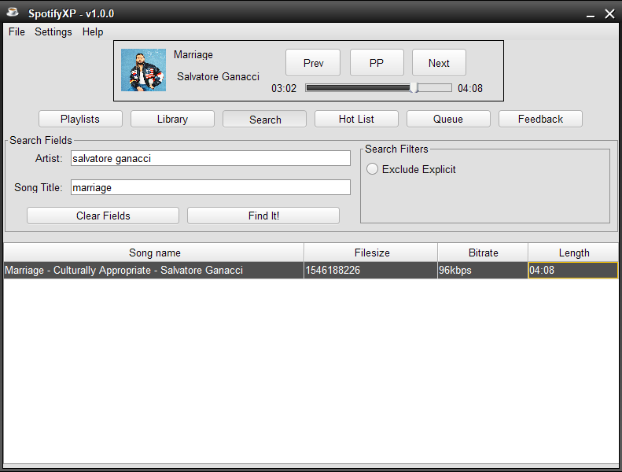
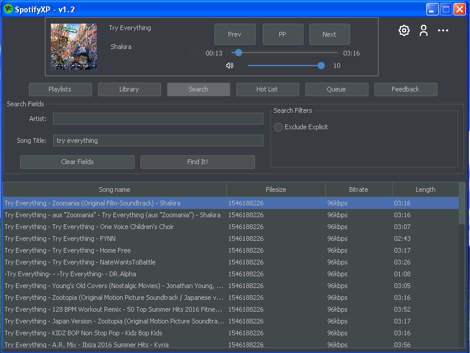

SpotifyXP
===============

<h4>Compile Info: Please open the project inside IntelliJ and compile it there I can't get maven to build this project without IntelliJ</h4>

<h4>Compile Info: The default branch is nightly!</h4>

<h3 style="display:inline">Only for Spotify Premium users
 

<a>Stable Design</a>

 
 
 
<a>Nightly Design</a>

