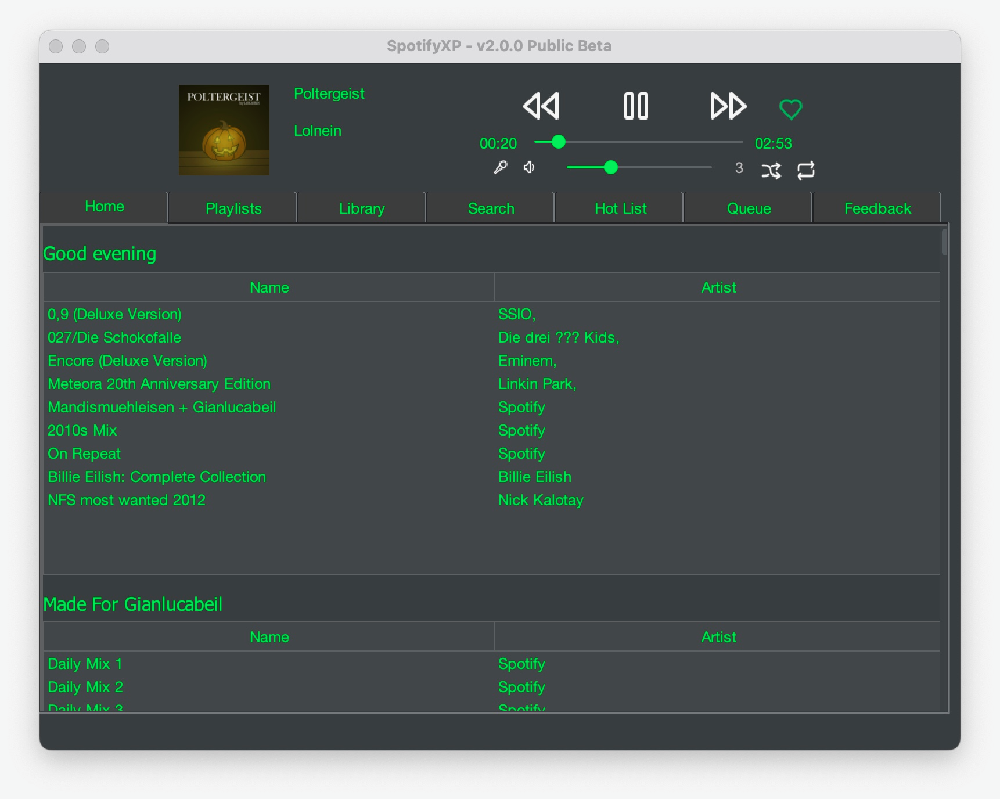

  

<h3 align="center">SpotifyXP</h3>

  

    A real Spotify Player for Windows XP
     
     
    <a href="https://github.com/Werwolf2303/SpotifyXP/issues">Report Bug</a>
    .
    <a href="https://github.com/Werwolf2303/SpotifyXP/issues">Request Feature</a>
  

  

## Table Of Contents

* [About the Project](#about-the-project)
* [System Requirements](#system-requirements)
* [Translating](#translating)
* [Built With](#built-with)
* [Getting Started](#getting-started)
* [Usage](#usage)
* [Contributing](#contributing)
* [License](#license)
* [Authors](#authors)
* [Special thanks](#Special-thanks)

## About The Project

Stable version

I programmed SpotifyXP for my old daily driver that runs Windows XP. My daily driver is now an MacBook Pro (2022)

<h5>Why use SpotifyXP:</h5>

On december 2022 Spotify shutdown it's last version for Windows XP so this application is the only way to listen to Spotify

## System Requirements

* OS: Windows XP (Unofficial: Windows 2000)
* Processor: Anything that can handle SNES Emulation
* RAM: 128MB (Maybe 64MB?)
* Storage (Without cache): 60MB
* Storage (With cache): My folder is 700MB

## Translating

If you want to translate this project look into src/main/resources/lang/skeleton.json

Make sure you have run 'python3 i18nhelper.py -skeleton' to make sure the skeleton is up to date

Rename skeleton.json to [2DigitLanguageCode].json

## Built With

SpotifyXP is build with

            <a>librespot-java</a>
             
            <a>commons-io:commons-io</a>
             
            <a>org.json:json</a>
             
            <a>commons-httpclient:commons-httpclient</a>
             
            <a>lc.kra.system:system-hook</a>
             
            <a>com.formdev:flatlaf</a>
             
            <a>com.jtattoo:JTattoo</a>
             
            <a>com.electronwill.night-config:toml</a>
             
            <a>com.lmax:disruptor</a>
             
            <a>xyz.gianlu.zeroconf:zeroconf</a>
             
            <a>com.squareup.okhttp3:okhttp</a>
             
            <a>commons-net:commons-net</a>
             
            <a>org.jcraft:jorbis</a>
             
            <a>com.google.protobuf:protobuf-java</a>
             
            <a>com.google.code.gson:gson</a>
             
            <a>com.neovisionaries:nv-i18n</a>
             
            <a>com.fasterxml.jackson.core:jackson-databind</a>
             
            <a>org.apache.httpcomponents.core5:httpcore5</a>
             
            <a>org.apache.httpcomponents.client5:httpclient5</a>
             
            <a>org.apache.httpcomponents.client5:httpclient5-cache</a>
             
            <a>org.slf4j:slf4j-api</a>
             
            <a>org.jetbrains:annotations</a>
             
            <a>uk.co.caprica:vlcj</a>
             
            <a>com.googlecode.plist:dd-plist</a>
             
            <a>org.apache.commons:commons-math3</a>
        

## Getting Started

1. Download the Stable version under Releases or download the nightly version under the Actions tab
2. Just run <pre>java -jar SpotifyXP.jar</pre>

## Usage

Follow the steps under 'Getting Started' and then login with your Email and Password. Then just listen to music

## Compiling

Just run the 'build.bat' inside the root of the repository. It will print some useful information

## Contributing

Just make your desired changes and open a pull request

### Creating A Pull Request

1. Fork the Project
2. Commit your Changes (`git commit -m 'Add some AmazingFeature'`)
3. Push to the Branch (`git push origin main`)
4. Open a Pull Request

## License

Not compatible with any license

## Authors

* **Werwolf2303** - ** - [Werwolf2303](https://github.com/Werwolf2303/) - **

## Special thanks

* [skippster1337](https://github.com/skipster1337) - For listing SpotifyXP on his site
*  that provided a free license for their [Java Profiler](https://www.yourkit.com/java/profiler/)
